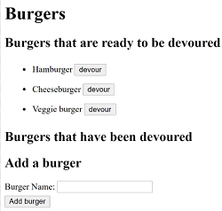

# Eat-Da-Burger!

## Description
A restaurant app that lets users input the names of burgers they'd like to eat. After they enter the burger name they can devour that burger.

## Installation 
Run the following command to install dependencies:
```
npm i
```
## Questions 
Please send any questions to NRYDER7@GMAIL.COM. You can find more of my work at [NRYDER7](https://github.com/NRYDER7)
## License 
None
## Screenshot
